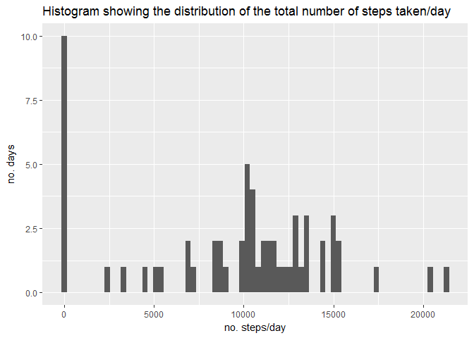

Reproducible Research: Course Project 1
========================================

This project uses the data from a personal activity monitoring device from an anonymous individual. The device recorded data at 5 minute intervals throughout the day during October and November 2012.

Firstly the data was downloaded into the current working directory, and the date/time that the data was accessed was recorded:

```r
File_URL <- "https://d396qusza40orc.cloudfront.net/repdata%2Fdata%2Factivity.zip"
download.file(File_URL, "Activity.zip")
DateDownloaded <- Sys.time()
```

The date this data was downloaded was:

```r
DateDownloaded
```

```
## [1] "2017-07-27 17:40:57 BST"
```


Next, we unzip the file and load it into R using read.csv, and assign it to the object ActivityData.


```r
unzip("Activity.zip")
ActivityData <- read.csv("activity.csv")
```

Now that the data is loaded, we need to see what the data looks like and what class each column/variable is. We do this by calling str to look at the structure of the data.


```r
str(ActivityData)
```

```
## 'data.frame':	17568 obs. of  3 variables:
##  $ steps   : int  NA NA NA NA NA NA NA NA NA NA ...
##  $ date    : Factor w/ 61 levels "2012-10-01","2012-10-02",..: 1 1 1 1 1 1 1 1 1 1 ...
##  $ interval: int  0 5 10 15 20 25 30 35 40 45 ...
```

This tells us that there are three columns:
- steps
- date
- interval

The 'steps' variable is the number of steps at 5 minute intervals, with missing values coded as 'NA'. This variable is of class 'integer', which is okay. It does not need to be changed.

The 'date' variable is the date (in YYY-MM-DD format) on which the data was collected. This variable is of class 'Factor', but we want it to be of the class 'Date'. We will need to change this before any further analysis is done.

The 'interval' variable is identifier for the 5 minute interval at which the measurement was taken. It is also of the 'integer' class, which seems appropriate.

The next step is to change the date variable into the 'date' class.


```r
ActivityData$date <- as.Date(ActivityData$date, format = "%Y-%m-%d")
```

Then we will check that this has worked by recalling str on the data.


```r
str(ActivityData)
```

```
## 'data.frame':	17568 obs. of  3 variables:
##  $ steps   : int  NA NA NA NA NA NA NA NA NA NA ...
##  $ date    : Date, format: "2012-10-01" "2012-10-01" ...
##  $ interval: int  0 5 10 15 20 25 30 35 40 45 ...
```

As we can see, the class of the date column is now 'Date'. 

Before we move on to the analysis, we will load the data packages we will need for the analysis:

```r
library(dplyr)
```

```
## Warning: package 'dplyr' was built under R version 3.3.3
```

```
## 
## Attaching package: 'dplyr'
```

```
## The following objects are masked from 'package:stats':
## 
##     filter, lag
```

```
## The following objects are masked from 'package:base':
## 
##     intersect, setdiff, setequal, union
```

```r
library(ggplot2)
```

```
## Warning: package 'ggplot2' was built under R version 3.3.3
```

```r
library(gridExtra)
```

```
## Warning: package 'gridExtra' was built under R version 3.3.3
```

```
## 
## Attaching package: 'gridExtra'
```

```
## The following object is masked from 'package:dplyr':
## 
##     combine
```


### What is the total number of steps taken each day?

To answer this question we will first calculate the total number of steps taken each day. This is done using the tapply function, with 'steps' as the 'value' column and 'date' as the 'factor' column. We than specify that we want to sum steps by date and that we want to ignore missing values (i.e. na.rm=FALSE).


```r
TotalSteps <- as.data.frame(with(ActivityData, tapply(steps,date,sum,na.rm=TRUE)))
colnames(TotalSteps) <- "steps"
```

Now that we have calculated the total number of steps, lets have a look at it as a histogram where the y axis will show the number of days for which a each total number of steps was achieved. The bin for this histogram was set to 300, as this gave good separation of the number of steps.


```r
ggplot(TotalSteps,aes(steps)) + geom_histogram(binwidth = 300) + ylab("no. days") + xlab("no. steps/day") + ggtitle("Histogram showing the distribution of the total number of steps taken/day")
```

<!-- -->

This histogram gives us an idea that the mean or number of steps per day should be somewhere around 10000 steps/day. However, there is a large number of days for which no steps are recorded, so this could skew the mean.

We will now calculate the mean and the median number of steps per day.


```r
mean(TotalSteps$steps)
```

```
## [1] 9354.23
```

```r
median(TotalSteps$steps)
```

```
## [1] 10395
```

As you can see, the mean is slightly lower than the median, and is probably skewed by the days on which no steps are recorded.

### What is the average daily activity pattern?

Now that we know the mean and median number of steps taken per day, we will investigate the time of day that these steps were recorded at. To do this, we will create a time series plot which plots the number of steps recorded at each 5 minute interval throughout the day.

Firstly, we need to calculate the average(mean) number of steps at each time interval.To do this, we will again use tapply. This time we use 'interval' as a factor and calculate the mean instead of the sum.


```r
AverageSteps <- as.data.frame(with(ActivityData, tapply(steps, interval, mean, na.rm=TRUE)))
colnames(AverageSteps) <- "steps"
AverageSteps$interval <- rownames(AverageSteps)
```

Next we will plot the results.


```r
ggplot(AverageSteps, aes(x=as.numeric(interval), y=steps)) + geom_line(colour="blue") + xlab("Interval") + ylab("Number of Steps") + ggtitle("Time Series (5-minute interval) of Steps Over a Day")
```

<!-- -->

Lastly, we want to know which 5 minute interval is associated with the highest level of activity (measured as number of steps).


```r
ArrangedSteps <- arrange(AverageSteps, desc(AverageSteps$steps))
```

```
## Warning: package 'bindrcpp' was built under R version 3.3.3
```

```r
ArrangedSteps[1,]
```

```
##      steps interval
## 1 206.1698      835
```

So the interval with the highest number of steps on average is interval 835.

### Imputting Missing Values

As we saw when we first took a look at the structure of the data, there appeared to be NA values present in the steps variable. As this could affect the analysis, we need to see how much data is missing.


```r
sum(is.na(ActivityData$steps))
```

```
## [1] 2304
```

To fill in the missing data, we will use the mean number of steps for the inteval to which this missing data belongs.


```r
ActivityNA <- subset(ActivityData, is.na(ActivityData$steps))
ActivitynoNA <- subset(ActivityData, !is.na(ActivityData$steps))
ActivityNA <- ActivityNA[,2:3]
ActivityNA <- merge(ActivityNA,AverageSteps, by="interval")
ActivityDataFull <- rbind(ActivityNA, ActivitynoNA)
```

Now we check to see whether we have removed all of the missing values.


```r
sum(is.na(ActivityDataFull))
```

```
## [1] 0
```

That shows that we were successful.

Now we want to know whether that had any impact on our total number of steps analysis. We will re-run the histogram with the new data set ActivityDataFull.


```r
TotalStepsFull <- as.data.frame(with(ActivityDataFull, tapply(steps,date,sum,na.rm=TRUE)))
colnames(TotalStepsFull) <- "steps"
plotNA <- ggplot(TotalSteps,aes(steps)) + geom_histogram(binwidth = 300) + ylab("no. days") + xlab("no. steps/day") + ggtitle("Missing Values Ignored")
plotnoNA <- ggplot(TotalStepsFull,aes(steps)) + geom_histogram(binwidth = 300) + ylab("no. days") + xlab("no. steps/day") + ggtitle("Missing Values Replaced with Mean for Interval")
grid.arrange(plotNA,plotnoNA, top="Histogram showing the distribution of the total number of steps taken/day")
```

<!-- -->

As we can see, this has impacted upon our histogram. We no longer have so many days where the total number of steps is 0. 

Now lets see how it has impacted upon the mean and median. First we will fetch the original mean and median to remind you what they were.


```r
mean(TotalSteps$steps)
```

```
## [1] 9354.23
```

```r
median(TotalSteps$steps)
```

```
## [1] 10395
```

Now we will look at the new mean and median.


```r
mean(TotalStepsFull$steps)
```

```
## [1] 10766.19
```

```r
median(TotalStepsFull$steps)
```

```
## [1] 10766.19
```

As you can see, this now has reduced the gap between the mean and median total number of steps to nothing, meaning that the extremes of the data in the original analysis are no longer affecting the results.

### Are there different patterns of activity between weekdays and weekends?

For this analysis we will use the new dataset with the missing values imputted.

Firstly, we need to create a new variable column which denotes whether or not the day in question is a weekday or a weekend day. we will do this useing ifelse and the weekdays function to find out the day of the week for each date.


```r
ActivityDataFull$weekday <- ifelse(weekdays(ActivityDataFull$date) %in% c("Saturday", "Sunday"), "weekend", "weekday")
```

Now we will re-create our time-series plot of the averagenumber of steps taken during the week and at the weekend.


```r
AverageFull<- as.data.frame(with(ActivityDataFull, tapply(steps, list(interval,weekday), mean, na.rm=TRUE)))
AverageFull$interval <- rownames(AverageFull)
weekdayplot <- ggplot(AverageFull, aes(x=as.numeric(interval), y=weekday)) + geom_line(colour="blue") + xlab("Interval") + ylab("Number of Steps") + ggtitle("Weekdays")
weekendplot <- ggplot(AverageFull, aes(x=as.numeric(interval), y=weekend)) + geom_line(colour="blue") + xlab("Interval") + ylab("Number of Steps") + ggtitle("Weekend")
grid.arrange(weekdayplot,weekendplot, top="Time Series (5-minute interval) of Steps Over a Day")
```

<!-- -->
